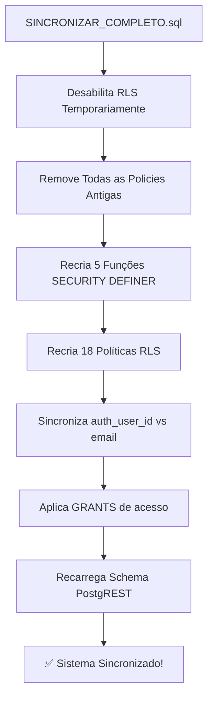

# 🔧 Sincronização Completa - Motor de Escalas + Portal do Membro

## 📋 Situação Diagnósticada

**Problemas Identificados:**
- ❌ Motor de escalas não está distribuindo membros automaticamente
- ❌ Personalização da paróquia não está sendo aplicada
- ❌ Funções SQL não foram sincronizadas no Supabase
- ❌ Políticas RLS (Row Level Security) podem estar incorretas

**Causa Raiz:**
O arquivo `PORTAL_MEMBRO_FIX.sql` contém todas as funções SQL e políticas necessárias, mas **NÃO foi executado no Supabase**. Sem essas funções e políticas, o motor TypeScript não consegue:
1. Validar acesso aos dados
2. Recuperar informações de membros e escalas
3. Aplicar as regras de distribuição corretamente

---

## 🚀 Como Corrigir (Passo a Passo)

### **Passo 1: Abrir o SQL Editor do Supabase**

1. Acesse: https://supabase.com/dashboard/project/`[SEU_ID_PROJETO]`/sql/new
2. Você verá um editor SQL vazio

### **Passo 2: Copiar o Script Maestro**

1. Abra o arquivo: `supabase/SINCRONIZAR_COMPLETO.sql` (criado nesta sincronização)
2. **Selecione TUDO** (Ctrl+A)
3. **Copie** (Ctrl+C)

### **Passo 3: Colar no Supabase**

1. No editor SQL do Supabase, **Cole** (Ctrl+V) o conteúdo completo
2. Veja o código aparecer no editor

### **Passo 4: Executar Script**

1. Procure pelo botão ▶️ **"Run"** (ou pressione Ctrl+Enter)
2. **Aguarde a execução**. Pode levar 30-60 segundos
3. Procure por mensagens de **erro em vermelho**. Se houver, verifique a causa

### **Passo 5: Validar Resultado**

Após a execução, você verá mensagens como:

```
✅ Success
   Rows affected: 0 (confirmação de que funções foram recriadas)
```

E um resultado de sincronização que mostra:
```
┌───────────────────────┬──────────────────┬─────────────────┐
│ membros_sincronizados │ sem_conta_auth   │ total_ativos    │
├───────────────────────┼──────────────────┼─────────────────┤
│ 12                    │ 3                │ 15              │
└───────────────────────┴──────────────────┴─────────────────┘
```

---

## 📊 O Que o Script Faz



### Funções Criadas:
| Função | Propósito |
|--------|-----------|
| `_portal_membro_id()` | Resolve qual membro é o usuário logado |
| `_portal_membro_paroquia(membro_id)` | Retorna paróquia do membro |
| `_portal_escala_paroquia(escala_id)` | Retorna paróquia da escala |
| `_portal_is_admin(paroquia_id)` | Verifica se é admin |
| `_portal_is_coord(membro_id)` | Verifica se é coordenador |

### Políticas RLS Aplicadas:
- **membros**: Acesso baseado em paróquia
- **escalas**: Membro vê apenas da sua paróquia
- **escala_membros**: Cada um vê suas próprias escalas
- **membro_ministerios**: Vinculações de ministérios
- **ministerios, paroquias, coordenadores**: Acesso granular
- **indisponibilidades, eventos, ocorrências**: Políticas específicas

---

## ✅ Após Sincronizar - Próximas Etapas

### 1. **Recarregar Aplicação**
```
F5 ou Ctrl+R no navegador
```

### 2. **Criar Nova Escala com Tipo Obrigatório**
```
Dashboard → Escalas → Nova Escala
  - Título: "Missa Dominical"
  - Data: [selecione]
  - Tipo de celebração: [OBRIGATÓRIO - selecione um tipo]
  - Salvar
```

### 3. **Validar Auto-Distribuição**
Após salvar, você deve ver a mensagem:
```
✅ Escala criada com X membro(s) sugerido(s) automaticamente.
```

Se NÃO aparecer essa mensagem, significa:
- ❌ Tipo de missa não foi selecionado (foi deixado em branco)
- ❌ Não há funções obrigatórias definidas para esse tipo
- ❌ Não há membros ativos na paróquia

### 4. **Publicar Escala e Validar no Portal**
```
Dashboard → Escalas → [sua escala]
  - Botão "Publicar" 
  - Abra o Portal do Membro
  - Procure pela escala → Deve aparecer!
```

---

## 🔍 Diagnóstico de Problemas

### **❌ Script retornou erro "permission denied"**
**Solução:**
- Você precisa estar logado como `super_admin` ou `service_role`
- Verifique seu token/sessão no Supabase

### **❌ Membros ainda não aparecem depois de criar escala**
**Checklist:**
1. ✅ O tipo de missa foi selecionado?
   ```sql
   SELECT id, tipo_missa_id FROM escalas ORDER BY created_at DESC LIMIT 1;
   -- Deve mostrar um UUID em tipo_missa_id, NÃO NULL
   ```

2. ✅ O tipo de missa tem funções obrigatórias?
   ```sql
   SELECT * FROM tipo_missa_funcoes 
   WHERE tipo_missa_id = '[seu_tipo_id]' 
   AND tipo_vinculo = 'obrigatoria';
   -- Deve retornar pelo menos 1 linha
   ```

3. ✅ Existem membros com as capacidades necessárias?
   ```sql
   SELECT m.id, m.nome, array_agg(mm.ministerio_id)
   FROM membros m
   LEFT JOIN membro_ministerios mm ON m.id = mm.membro_id
   WHERE m.paroquia_id = '[sua_paroquia_id]'
   AND m.ativo = true
   GROUP BY m.id, m.nome;
   ```

### **❌ Portal do Membro não mostra as escalas publicadas**
**Checklist:**
1. ✅ Existem registros em `escala_membros`?
   ```sql
   SELECT COUNT(*) FROM escala_membros 
   WHERE escala_id = '[sua_escala_id]';
   -- Deve ser > 0
   ```

2. ✅ Membro está `ativo`?
   ```sql
   SELECT id, nome, ativo FROM membros WHERE paroquia_id = '[sua_paroquia_id]';
   ```

3. ✅ Políticas RLS estão habilitadas?
   ```sql
   SELECT schemaname, tablename, rls_enabled 
   FROM information_schema.tables 
   WHERE table_schema = 'public' 
   AND tablename IN ('escalas', 'escala_membros');
   -- Deve retornar true em rls_enabled
   ```

---

## 📁 Arquivos Relacionados

| Arquivo | Propósito |
|---------|-----------|
| `supabase/SINCRONIZAR_COMPLETO.sql` | ✅ **USE ESTE AGORA** - Script maestro |
| `supabase/PORTAL_MEMBRO_FIX.sql` | Referência - foi consolidado no novo |
| `src/lib/escala-engine.ts` | Motor TypeScript (NÃO PRECISA MUDAR) |
| `src/routes/_authenticated/escalas.tsx` | Interface (NÃO PRECISA MUDAR) |

---

## 🎯 Validação Rápida

Execute estas queries **APÓS** a sincronização para confirmar que tudo funciona:

### Query 1: Verificar Funções SQL
```sql
SELECT proname FROM pg_proc 
WHERE proname IN ('_portal_membro_id', '_portal_is_admin')
ORDER BY proname;
-- Deve retornar 5 linhas
```

### Query 2: Verificar Políticas RLS
```sql
SELECT COUNT(*) FROM pg_policies 
WHERE schemaname = 'public';
-- Deve retornar >= 18 linhas
```

### Query 3: Verificar Sincronização de Auth
```sql
SELECT COUNT(*) as total, 
       COUNT(CASE WHEN auth_user_id IS NOT NULL THEN 1 END) as com_auth
FROM membros 
WHERE ativo = true;
-- Deve mostrar alguns membros vinculados
```

---

## 💡 Lembrete: Personalização de Paróquias

As configurações da paróquia (que afetam o motor de escalas) estão em:

```sql
SELECT id, nome, regras_escala, usa_tochas, usa_turibulo, usa_naveta
FROM paroquias
WHERE id = '[sua_paroquia_id]';
```

**Campos personalizáveis** no `regras_escala` (JSON):
```json
{
  "limite_semanal": 3,              -- Max escalas por membro/semana
  "limite_mensal": 8,               -- Max escalas por membro/mês
  "impedir_repeticao_consecutiva": true,
  "prioridade_score": true,         -- Usa score na distribuição
  "permitir_duplicidade": false,    -- Mesmo membro > 1 função/escala
  "peso_solene": 2,                 -- Peso para escalas solenes
  "peso_normal": 1                  -- Peso para escalas normais
}
```

Para alterar:
```sql
UPDATE paroquias
SET regras_escala = jsonb_set(
  regras_escala,
  '{limite_semanal}',
  '3'::jsonb
)
WHERE id = '[sua_paroquia_id]';
```

---

## 🎉 Próximos Passos

✅ **Imediato:**
1. Execute o script `SINCRONIZAR_COMPLETO.sql`
2. Recarregue o aplicativo
3. Crie uma nova escala e teste

✅ **Curto Prazo:**
1. Verifique se membros aparecem no Portal
2. Teste a confirmação/recusa de escalas
3. Verifique notificações

✅ **Otimizações:**
1. Personalize `regras_escala` conforme necessário
2. Ajuste `usa_tochas`, `usa_turibulo`, etc. para sua realidade litúrgica
3. Crie mais "Tipos de Missa" com diferentes conjuntos de funções

---

## 📞 Suporte

Se continuar com problemas:
1. Verifique os logs do Supabase em https://supabase.com/dashboard/project/[ID]/logs
2. Execute as queries de diagnóstico acima
3. Verifique se há erros TypeScript no console do navegador (F12)
