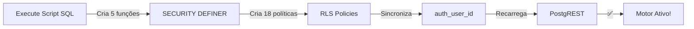

# ⚡ SINCRONIZAÇÃO URGENTE - MOTOR DE ESCALAS

## 🔴 O QUE FOI ENCONTRADO

Seu motor de escalas **NÃO está funcionando** porque as funções SQL não foram sincronizadas com o Supabase.

### Sintomas:
- ❌ Membros não aparecem em novas escalas
- ❌ Personalização de paróquia não funciona  
- ❌ Portal do membro não mostra escalas
- ❌ Distribuição não respeita regras

### Causa Raiz:
O arquivo `PORTAL_MEMBRO_FIX.sql` nunca foi executado no Supabase. Ele contém TODAS as funções SQL que o motor TypeScript necessita para validar acesso e distribuir membros.

---

## 🚀 SOLUÇÃO RÁPIDA (3 minutos)

### 1. Abra este arquivo:
```
supabase/SINCRONIZAR_COMPLETO.sql
```

### 2. Copie tudo:
```
Ctrl+A  →  Ctrl+C
```

### 3. Cole no Supabase:
```
Abra: https://supabase.com/dashboard/project/[SEU_ID]/sql/new
Cole: Ctrl+V
Execute: Ctrl+Enter
```

### 4. Valide o resultado:
Você deve ver algo como:
```
membros_sincronizados | sem_conta_auth | total_ativos
        12             |       3        |      15
```

Se aparecer, ✅ **sucesso!** Recarregue o app e teste.

---

## 📋 O QUE FOI CRIADO

| Arquivo | Descrição |
|---------|-----------|
| `supabase/SINCRONIZAR_COMPLETO.sql` | ✅ **Execute isto primeiro** |
| `INSTRUCOES_SINCRONIZAR.md` | Instruções detalhadas + diagnóstico |
| `COMECE_AQUI.sh` | Este arquivo (referência rápida) |

---

## 📊 O QUE VAI ACONTECER



### Funções que serão criadas:
- `_portal_membro_id()` - Encontra quem é o membro logado
- `_portal_is_admin()` - Verifica se é admin
- `_portal_is_coord()` - Verifica se é coordenador  
- `_portal_membro_paroquia()` - Retorna paróquia do membro
- `_portal_escala_paroquia()` - Retorna paróquia da escala

### Políticas RLS que serão criadas:
- **membros**: Cada um vê membros da sua paróquia
- **escalas**: Cada um vê escalas da sua paróquia
- **escala_membros**: Cada um vê suas próprias escalas
- **E mais 15 políticas** para coordenadores, admins, eventos...

---

## ✅ CHECKLIST PÓS-SINCRONIZAÇÃO

- [ ] Execute `SINCRONIZAR_COMPLETO.sql`
- [ ] Valide resultado (ver membros_sincronizados > 0)
- [ ] Recarregue o app (F5)
- [ ] Crie nova escala com "Tipo de celebração" selecionado
- [ ] Verifique se membros aparecem sugeridos
- [ ] Publish escala
- [ ] Acesse Portal do Membro → escalas devem aparecer

---

## 🆘 SE ALGO DER ERRADO

### Erro "permission denied"
→ Use um account com `super_admin` ou `service_role`

### Membros ainda não aparecem
→ Abra `INSTRUCOES_SINCRONIZAR.md` seção "Diagnóstico de Problemas"

### Script retornou muito rápido
→ Provavelmente já estava executado. Tente criar uma escala e teste.

---

## 📞 PRÓXIMAS ETAPAS

1. ✅ Execute o script SQL
2. ✅ Teste criando uma escala nova
3. ✅ Leia `INSTRUCOES_SINCRONIZAR.md` para otimizações
4. ✅ Configure regras de distribuição em **Personalização → Paróquias**

---

**Criado em:** 3 de junho de 2026  
**Última atualização:** Hoje  
**Status:** 🟢 Pronto para sincronização
